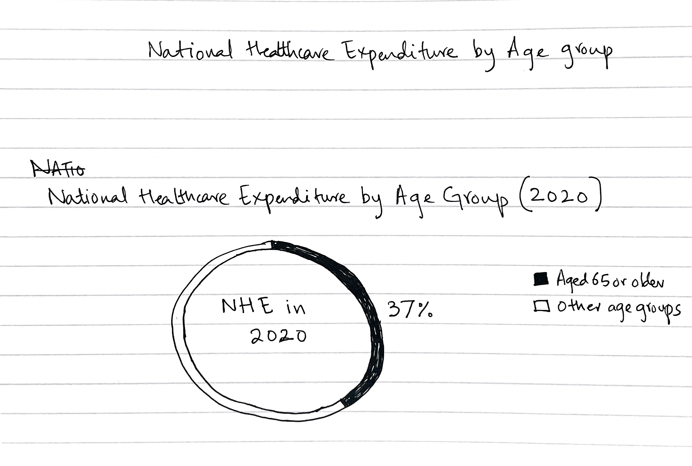

# Americans are living longer, but at what cost?
## Summary
The project aims to communicate the dual reality of an aging US population - the achievement of longer life expectancy and the simultaneous increase in challenges related to chronic diseases, loss of income, healthcare costs, and dependence on others for Activities of Daily Living (ADLs). While longer life expectancy is a positive outcome of innovation in medicine and improvements in healthcare, it is accompanied by a growing set of challenges that diminish the quality of life for many seniors. 
Through effective data visualizations, I hope to advocate and communicate the need for a holistic approach to address the evolving needs of seniors and inform policies that enhance their overall well-being.

## Outline 
1. Introduction:
A brief overview of the demographic shift towards an aging population in the U.S. and the implications for healthcare services and societal structures .

2. Chronic Disease Prevalence:
Statistics on the prevalence of one or more chronic diseases in the population aged 65 and older, and the expected growth in this percentage till 2050.
Discuss insights and the burden on individuals and the healthcare systems.

3. Quality of Life Metrics:
Overview of selected metrics impacting the quality of life for seniors:
a. Poverty/Loss of Income:
Examination of the economic challenges faced by elderly individuals.
b. Out-of-Pocket Healthcare Costs:
Analysis of the financial burden of healthcare on the elderly.
c. Dependence on Others for ADLs:
Discussion on challenges and implications for seniors and caregivers.
d. Social Isolation:
Exploration of contributing factors and the impact on mental health.

4. Longterm Healthcare Needs
Discussion on the long temr healthcare needs that most seniors have, and the current state of long-term healthcare.

5. Discussion on Solutions and Policy Recommendations
Analysis of existing policies and their effectiveness and an exploration of holistic solutions considering healthcare, social, and economic aspects.

6. Summarization of key findings and an emphasis on the interconnected nature of challenges and the need for comprehensive solutions.

7. Call to Action:
Encouragement for policy and healthcare students/professionals to work towards optimized care for the aging population and advocacy for better initiatives focused on improving the lives of seniors.

## Initial sketches
The growing elderly population of the US

Prevalence of chronic disease in the elderly

The percentage of National Healthcare Expenditure in 2020 attributed to population 65 and older

Increase in poverty among the elderly population from 2019 to 2023

## Data sources

To show the increase in the elderly population in the US over the past 50 years, I'll be using the Decennial Census of Population, 1900 to 2000; 2010 Census Summary File 1, and 2020 Census Demographic and Housing Characteristics File

Data for the current and projected chronic disease burden for the elderly population was taken from a [table1](https://www.ncbi.nlm.nih.gov/pmc/articles/PMC9881650/table/T1/) of [Projecting the chronic disease burden among the adult population in the United States using a multi-state population model (https://www.ncbi.nlm.nih.gov/pmc/articles/PMC9881650/#:~:text=Most%20individuals%20with%20at%20least,of%2060%20to%2079%20years.), a paper authored by John P. Ansah and Chi-Tsun Chiu for NCBI.

## Method and Medium
I will use Shorthand to build this project, and will be presenting from it for the final project presentation.

